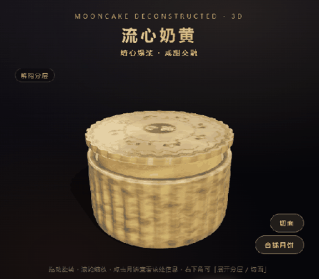
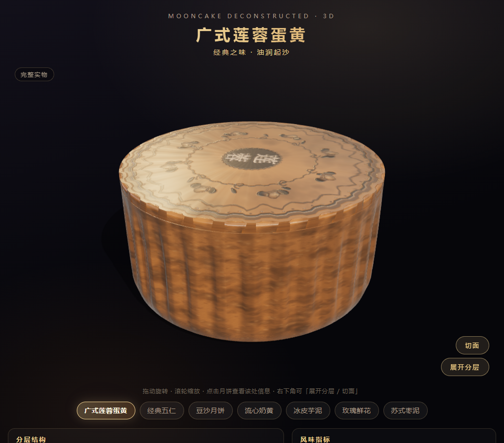
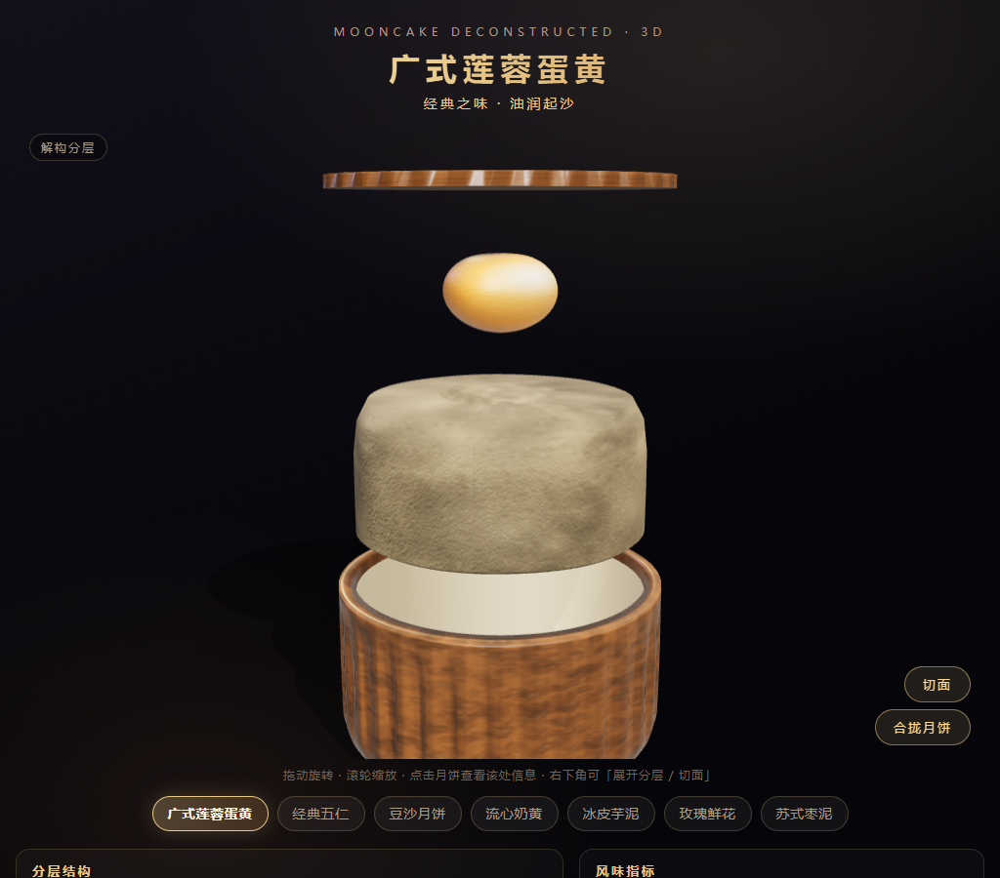
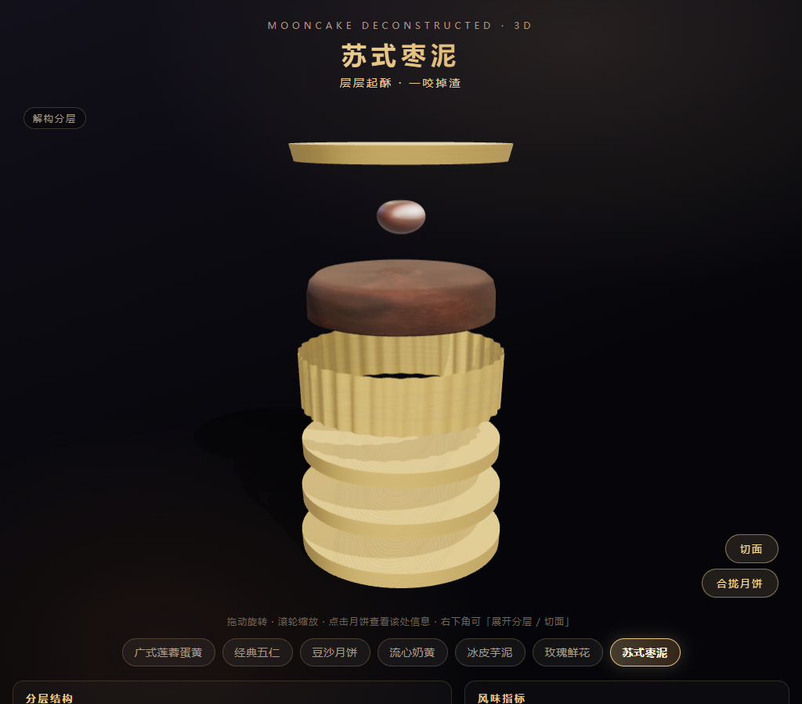
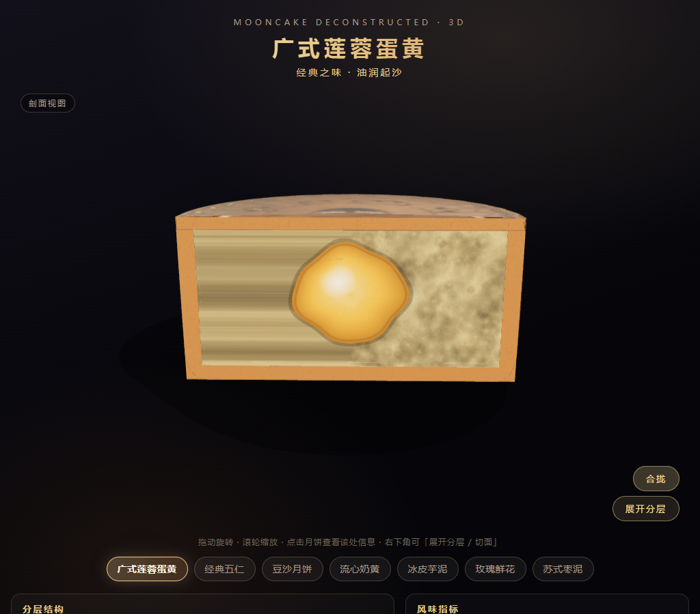

# 月饼解构实验室

> 一组关于「中秋月饼内部长什么样」的网页交互作品存档——零构建、单 HTML 文件，可直接双击打开。主推 `demo-C3-月饼3D.html`：用 Three.js 把月饼沿中轴拆开，7 大门派月饼可拆解 / 剖切 / 旋转，附热量换算。

## 展示

| 广式莲蓉蛋黄（合拢 / 展开） | 苏式枣泥（层层起酥 · 展开） |
|---|---|
|   |  |

## 作品一览（本仓库聚焦「月饼解构」方向）

| 文件 | 名称 | 说明 |
|---|---|---|
| `demo-C3-月饼3D.html` | **月饼解构实验室（主推）** | Three.js 3D，7 大门派月饼可拆解 / 剖切 / 旋转，附热量换算；程序化贴图、按需阴影、弱机自适应降级 |
| `demo-C2-月饼解构.html` | 月饼解构（SVG 版） | 纯 SVG + feTurbulence 滤镜的月饼剖面插画，兜底方案 |

> 另两个早期探索方向——`demo-A 谜趣中秋`（灯谜 / 诗词填空）与 `demo-C 轻食中秋`（热量估算）——已放弃，仅留存于本地，不纳入本仓库。

主推 `demo-C3-月饼3D.html`：零构建单文件，依赖仅通过 importmap 引 Three.js CDN；所有质感（油皮光泽、酥皮碎屑、莲蓉起沙、蛋黄砂感）均由 canvas 程序化生成——**默认不加载任何照片素材**；文件内另内嵌一张广式月饼实拍顶面贴图（base64 JPEG），仅在 URL 追加 `?phototop=1` 时启用，否则走程序化「模具压花」。

## 快速体验

- **在线体验**：<https://reserendipity.github.io/Mooncake-Deconstruction/>（GitHub Pages，零安装；Demo 需联网加载 Three.js CDN）。
- **直接打开**：双击 `demo-C3-月饼3D.html`（需联网加载 Three.js CDN），推荐 Chrome / Edge。
- 操作：底部切换 7 种月饼 → 拖拽旋转 / 滚轮缩放 → 「解构展开」看分层 → 「剖面视图」看切面。

## 验证方法论（本仓库附带自验工具）

为保证「改好了这个、没改坏那个」，页面内置数值自检，并配一套无头验证脚本（依赖 Playwright + SwiftShader 软件渲染）：

1. `node tools/check_html_scripts.js demo-C2-月饼解构.html demo-C3-月饼3D.html` —— 抽取页面内所有脚本（普通 + module）做语法校验（CI 同款；早期仅 module 版脚本为 `check_syntax.js`）。
2. `python _mkverify.py` —— 把 CDN 依赖替换成本地 `three.module.local.js` / `addons/`，生成 `_verify-c3.html`（避免 `file://` 的 CORS 限制）。
3. 起本地服务 `python -m http.server 8931`，再用 `python _verify_run.py "http://127.0.0.1:8931/_verify-c3.html?static=1&verifyall=1"` 跑 `?verifyall=1` 全量断言：**7 类型 × 合拢 / 展开 14 组状态，各层不越出视口、内芯不穿透外壳**，无头浏览器 14/14 通过。
4. `python _perf_test.py` / `python _regress.py` —— 交互空转冒烟 / 静态帧 PIL 比色回归。

> 依赖安装：`pip install -r requirements.txt && python -m playwright install chromium`。
> 一键跑通第 2–3 步：`python verify.py`（默认端口 8931，`--port` 可换；断言全过退出码 0，否则 1）。

## 目录说明

- `index.html`：本地入口页，集中链接两件作品（GitHub Pages 亦以此为首页）。
- 根目录 `demo-C2/C3-*.html`：2 件月饼解构交付作品。
- `trae-vibecoding-创意方案与去重分析.md`：早期选题分析（活动要求提取 + 作品去重聚类 + 空白区分析）。
- `投稿帖-主稿.md`：对外发帖草稿（如参与社区活动时使用），含素材清单。
- `*.py`：上述验证 / 截图工具；`verify.py` 为一键跑通「生成 → 起服务 → 跑断言」的入口。
- `tools/check_html_scripts.js`：CI 用的通用脚本语法校验；`check_syntax.js` 为早期仅 module 版本。
- `requirements.txt`：验证工具链的 Python 依赖（Playwright / Pillow）。
- `addons/`、`three.module.local.js`：本地无头验证用的 Three.js 副本（交付件本身走 CDN）。
- `post-assets/`：展示用截图与封面 GIF（本 README 引用的图片均在此目录）。

## 许可

Apache License 2.0 —— 见 `LICENSE`。Copyright 2026 ReSerendipity。
